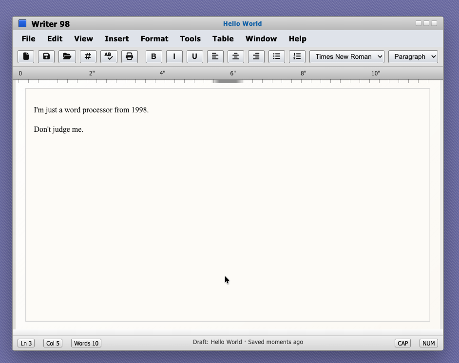

## Writer 98

**Writer 98** is a single-file retro word processor inspired by classic Word/OS-era editors. It lets you
draft rich text documents, format paragraphs and lists, enjoy pixel-perfect chrome, and autosave
everything to `localStorage` without touching a server.

You can use it live at [https://writer-98.com](https://writer-98.com).

To run it locally, simply:

1. Clone this repo.
2. Open `index.html` directly in your browser or serve it with a static file server (e.g. `npx serve .`).
3. If you want to take advantage of `localStorage` isolation per draft, add `?d=<name>` to the URL.

### Features

- 3D-style window frame with title/menu/toolbar/status inspired by Word 98, plus responsive mobile
  handling (fixed chrome, toolbar wrapping, simplified status bar).
- Rich toolbar actions: new drafts, save/clipboard copy, print, bold/italic/underline, list/alignment controls,
  and a dropdown picker for fonts and heading levels.
- Inline spell-check helper, keyboard shortcuts, and autosave-to-localStorage (draft key derived from `?d=`).
- Draft management via "Open Drafts" modal with load/delete/undated metadata and `/Open Drafts` 
  accelerator (`Ctrl+O`).
- "New Document" workflow (`Ctrl+N`/toolbar): saves the current draft, prompts for a name, warns on
  collisions, and navigates to `index.html?d=<slug>`.
- Markdown formatter button that converts `#` headings, `-` lists, and `**bold**`, `*italic*`, `` `code` ``
  markup into rich text blocks when requested.
- AI assistant accessed with `Ctrl+K`: highlight text, enter an instruction plus passphrase-backed OpenAI
  key (stored encrypted in `localStorage`), choose model/temperature, and replace the selection with
  HTML returned by the model.
- Share a rich-text draft via toolbar share button: text is compressed with LZ-String, prefills the editor
  when visiting `https://writer-98.com/?m=<payload>`, and exposes a modal with copyable URL.

### Getting started

1. Open `index.html` in a browser.
2. Use the toolbar or keyboard shortcuts to format text, save drafts, or open the modal list of saved
   drafts.
3. `localStorage` keeps each draft keyed by `writer98-doc-<slug>` and metadata under
   `writer98-meta-<slug>`.

No build step is required; just open the HTML file in any modern browser.
